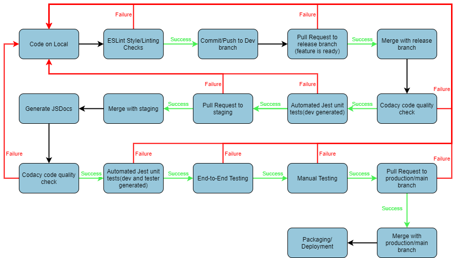

# Powellmon CI/CD Pipeline Phase 2 Status (05/24/2021)
## Pipeline diagram

## Overview
### Dev branch (-dev)
The first branch in our pipeline are the dev branches for each person in our group (name of person-dev). This branch is where new features for our web app are first created by developers. ESLint Style/Linting checks occur on this branch. 

#### ESLint Style/Linting checks 
The first step in our pipeline is to run the ESLint tool for linting and code style enforcement. This occurs when any code in the `source` folder is about to be committed to the repo. 

This step is implemented with a pre-commit hook in the file `git-hooks/precommit` that runs ESLint on any staged files. This step in our pipeline is currently functional and is now updated with our group's style guide. Details on our style guide can be found in [styleguide.md](styleguide.md). 

After the code passes the ESLint style/Linting checks, it is then committed/pushed to the dev branch on the remote Github repo.

### Release branch (-release)
Once a feature is completed and ready for testing, developers can then open and merge a pull request from their dev branch into their release branch (name of person-release). This branch is where new features for our web app are checked for code quality and individually tested using developer-generated unit tests. 

#### Codacy code quality check 
When the code is merged to the release branch, the next step in our pipeline is to run a Codacy code quality check on the pushed code. 

This step is implemented using Github Actions and is the first job defined in the workflow at `.github/workflows/release-workflow.yml`. The workflow is triggered when anything new is pushed to the `source` folder in any release branch. The first job checks out a copy of the code and uses [this Github action](https://github.com/marketplace/actions/codacy-analysis-cli#analysis-with-default-settings) to run Codacy's static analysis tools on the code. This step in our pipeline is currently functional. 

#### Automated Jest unit tests (developer only)
After the code passes the Codacy code quality check, we then run our automated developer generated unit tests on the code using Jest. 

This step is implemented using Github Actions and is the second job defined in the workflow at `.github/workflows/release-workflow.yml`. This job checks out a copy of the code and runs the command `npm test -- dev`, which runs only our developer-generated Jest tests (located in `test/dev` folder) on the source code. This step in our pipeline is currently functional and will continue to work as we add new source code and tests. 

### Staging branch (staging)
After the code passes the code quality scan and developer-generated unit tests, developers can then open a pull request and wait for manual review/merging of their code to the staging branch.
This branch is where new features are collectively tested together with the entire app with developer + tester generated unit tests, end-to-end tests, and manual tests. JSDoc generation also occurs on this branch. 

#### Automated Jest unit tests (developer and tester only)
When the code is merged to the staging branch, the next step in our pipeline is to run all our unit tests (developer and tester generated) on the pushed code. 

This step is implemented using Github Actions and is the first job defined in the workflow at `.github/workflows/staging-workflow.yml`. The workflow is triggered when anything new is pushed/merged to the `source` folder in the staging branch. This job checks out a copy of the code and runs the commands `npm test -- dev` and `npm test -- tester`, which runs all our developer and tester Jest unit tests (located in the `test/dev` and `test/tester` folders) on the source code. This step in our pipeline is currently functional and will continue to work as we add new source code and tests. 

#### Generate JSDocs 
After the code passes both the developer and tester unit tests, the next step in our pipeline involves automatically generate documentation from the code. 

This step is implemented using Github Actions and is the second job defined in the workflow at `.github/workflows/staging-workflow.yml`.  After checking out a copy of the code, this workflow runs this [action](https://github.com/marketplace/actions/jsdoc-action), which uses JSDoc to generate Javscript documentation. The workflow then pushes this documentation to the `docs/` folder in our repo. This step in our pipeline is currently functional and will continue to work as we add new source code. 

#### End to End testing
The next step in our pipeline is to run end-to-end tests on the pushed code. 

This step is not currently implemented yet. We are currently looking into using Github Pages to host the staging code and using [jest-puppeteer](https://github.com/smooth-code/jest-puppeteer) to actually run the end-to-end tests. 

#### Manual testing/approval
After the code goes through the testing in the staging branch, we then open a pull request to merge the code to our production/main branch. In our approval process for this pull request, we plan to also include some manual integration- or system-level testing.  

This step is not currently implemented yet. We plan to implement this step in the last phase, possibly using techniques like pixel differencing. 

### Main/Production Branch (main)
The final branch in our pipeline is the main/production branch, which stores the code that will be actively deployed on our web app. Minification, packaging, and deployment will occur on this branch. 

#### Packaging/deployment
The final step in our pipeline is packaging and deployment, which occurs after the code has arrived at the production/main branch and passed all tests.  

This step is not currently implemented yet. We plan to implement this step  in the last phase. Some preliminary options for deployment that we are considering include [Firebase hosting](https://firebase.google.com/docs/hosting) and [Herokuapp](https://www.heroku.com/free). 

## Demo video
Video demo of our phase 1 pipeline can be found [here](https://www.youtube.com/watch?v=YNwufPw2_48)