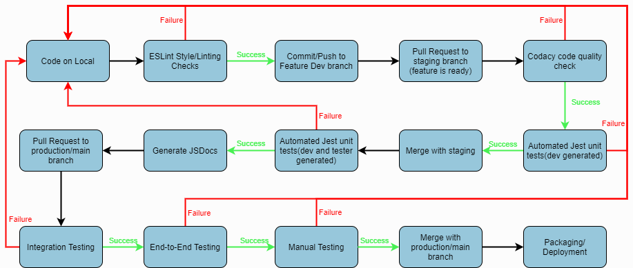

# Powellmon CI/CD Pipeline Phase 3 Status (06/10/2021)
## Pipeline diagram

## Overview
### Setup
To set up a local copy of our repo to follow this pipeline, follow these steps:  
1. Clone the repo from main
2. Install Node.js and npm
3. Run `npm install` to install the dev dependencies/set up pre-commit hook for linter 
  
### Feature Dev branch (-dev)
The first branch in our pipeline are the dev branches for each person in our group (`feature-[name of feature]`). These branches are where new features for our web app are first created by developers. ESLint Style/Linting checks occur on this branch.  

#### ESLint Style/Linting checks 
The first step in our pipeline is to run the ESLint tool for linting and code style enforcement. This occurs when any code in the `source` folder is about to be committed to the repo. 

This step is implemented with a pre-commit hook in the file `git-hooks/precommit` that runs ESLint on any staged files. This step in our pipeline is currently functional and is updated with our group's style guide. Details on our style guide can be found in [styleguide.md](styleguide.md). 

After the code passes the ESLint style/Linting checks, it is then committed/pushed to the dev branch on the remote Github repo.  
**Note:** The linter automatically fixes some style issues during commit. After committing, you may have to make an additional commit to add these fixes.

### Pull Request to Staging
Once a feature is completed and ready for testing, developers can then open a pull request from their dev branch to the staging branch (`staging`). For this pull request to be merged, the new feature will need to pass a Codacy code quality check and the developer generated unit tests.

#### Codacy code quality check 
When a pull request to the staging branch is made for the new feature, the next step in our pipeline is to run a Codacy code quality check on the pushed code. 

This step is implemented using Github Actions and is the first job defined in the workflow at `.github/workflows/release-workflow.yml`. The workflow is triggered when anything new is pushed to the `source` folder in any release branch. The first job checks out a copy of the code and uses [this Github action](https://github.com/marketplace/actions/codacy-analysis-cli#analysis-with-default-settings) to run Codacy's static analysis tools on the code. This step in our pipeline is currently functional. 

#### Automated Jest unit tests (developer only)
After the code passes the Codacy code quality check, we then run our automated developer generated unit tests on the code using Jest. 

This step is implemented using Github Actions and is the second job defined in the workflow at `.github/workflows/release-workflow.yml`. This job checks out a copy of the code and runs the command `npm test -- dev`, which runs only our developer-generated Jest tests (located in `test/dev` folder) on the source code. This step in our pipeline is currently functional and will continue to work as we add new source code and tests. The latest coverage report for our automated tests can be found here.

### Staging/Release branch (staging)
After the code passes the code quality scan and developer-generated unit tests, the new pull request will then be merged to the staging branch.  
This branch is where new features are collectively tested together with the entire app with developer + tester generated unit tests, integration tests, end-to-end tests, and manual tests. JSDoc generation also occurs on this branch. 

#### Automated Jest unit tests (developer and tester only)
When the code is merged to the staging branch, the next step in our pipeline is to run all our unit tests (developer and tester generated) on the pushed code. 

This step is implemented using Github Actions and is the first job defined in the workflow at `.github/workflows/staging-workflow.yml`. The workflow is triggered when anything new is pushed/merged to the `source` folder in the staging branch. This job checks out a copy of the code and runs the commands `npm test -- dev` and `npm test -- tester`, which runs all our developer and tester Jest unit tests (located in the `test/dev` and `test/tester` folders) on the source code. This step in our pipeline is currently functional and will continue to work as we add new source code and tests. The latest coverage report for our automated tests can be found here.

#### Generate JSDocs 
After the code passes both the developer and tester unit tests, the next step in our pipeline involves automatically generate documentation from the code. 

This step is implemented using Github Actions and is the second job defined in the workflow at `.github/workflows/staging-workflow.yml`.  After checking out a copy of the code, this workflow runs this [action](https://github.com/marketplace/actions/jsdoc-action), which uses JSDoc to generate Javscript documentation. The workflow then pushes this documentation to the `docs/` folder in our repo. This step in our pipeline is currently functional and will continue to work as we add new source code. 

### Pull Request to Main
Once a feature has passed the developer and tester generated unit tests, developers can then open a new pull request to the main deployment branch `(main)`. For this pull request to be merged, the new feature will have to pass integration tests, end-to-end tests, and manual tests. 

#### Automated Jest integration tests
After a pull request is made to main, the first step is to run our automated integration tests to make sure the feature works correctly with the overall app.  

This step is implemented using Github Actions and is the first job defined in the workflow at `.github/workflows/integration-workflow.yml`. This job checks out a copy of the code and runs the command `npm test -- integration`, which runs only our integration Jest tests (located in `test/integration` folder) on the source code. This step in our pipeline is currently functional and will continue to work as we add new source code and tests. The latest coverage report for our automated tests can be found here.

#### End to End testing
The next step in our pipeline is to run end-to-end tests on the pushed code, so that we can test user flows for the app.  

These tests are conducted by manually running the command `npm test -- e2e --runInBand` on a local copy of the staging branch. This will run our Jest Puppeteer end-to-end tests (located in `test/e2e`) serially on the source code. This step in our pipeline is currently functional and will continue to work as we add more end-to-end tests. End-to-End test reports are stored at this folder and the latest end-to-end test report can be found here.  

**Note:** If some of the tests fail, puppeteer may need to be manually set to not headless mode (set `headless: false` in `jest-puppeteer.config.js`).

#### Manual testing/approval
After the code goes through the integration and end-to-end testing, we then conduct manual testing/review of features that were more difficult to test and not related to overall flow of the app, such as light/dark theme, backup/upload, and mini calendar. This step is currently functional and will continue to work as we add more manual test cases. Manual test cases can be found here.

### Main/Production Branch (main)
After the code passes the integration, end-to-end, and manual tests, the new pull request can be merged to the main branch. 
This final branch in our pipeline is the main/production branch, which stores the code that will be actively deployed on our web app. Deployment occurs on this branch. 

#### Deployment
The final step in our pipeline is deployment, which occurs after the code has arrived at the production/main branch and passed all tests.  
This step is handled by Github Pages, which automatically deploys code pushed to main to the Github page for our app, located here. 

## Demo video
Final video demo of our phase 3 pipeline can be found [here](https://www.youtube.com/watch?v=YNwufPw2_48)