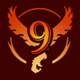

# Powellmon (Team 9)						
## *“Gotta code ‘em all!”* 

### I. *The Values that Define Us*:
- Work Smarter, ***not*** Harder
- Be Open to **New Ideas**
- Put *users* **first**
- Act with **Integrity**
- Collaborate as a **Team**
- Take the ***Initiative*** to Solve Problems
- Always be ***Pursuing*** New Knowledge

### **II.** ***Who We Are***:
#### **Alan Wang**:
*Hey, I’m Alan! I’m a second year computer science major from Warren College. In my spare time, I enjoy playing video games, reading manga, and watching anime. Through this project, I hope to gain a greater understanding of what software engineering roles exist out there and how they all work together.*

**Skills:**
- Java
- Python
- C++/C
  
**Github:** https://github.com/alanlwang1 

#### **Daisuke Chon**:
*Good day all. I’m Daisuke. I’m a third year economics and computer science double major from Sixth College. I’m into martial arts, video games, manga/anime, vtubers, and cooking. I also run UCSD’s Kendo and Iaido clubs where we practice Japanese swordsmanship. (It’s actually a lot less cringy than it sounds) I hope this class will teach me how teamwork works in a professional software development setting as well as allow me to contribute my best effort to this group’s numerous projects.*

**Skills:**
- Java
- C/C++
- Python

**Github:** https://github.com/ecstaticstupidity

#### **Edmund Leibert III**:
*Hello, internet! My name is Edmund Leibert and I am a second year transfer (almost done!) at Sixth College. Currently I am an undergraduate student majoring in Compute Engineering, but intend to stay an extra year at UCSD to get a master's in Machine Learning & Data Science. In my free time when I am not coding, I love to surf, skateboard at night, design 3d art, kickbox, and weightlift. I am also an avid cooker, so please send me your fmaily recipies! Overall, I look forward to be a team leader on this project and can't wait to see what we together accomplish. Til then, take care!*

**Skills:**
- Javascript,HTML,CSS (AngularJS, Bootstrap, Node.js)
- PHP (Laravel)
- Python (Django, Flask)
- R
- MATLAB
- Tensorflow, PyTorch, AzureAI

**Github link:** https://github.com/edwardyang12

#### **Edward Yang**:
*Hey, I’m Edward! I’m a second year computer science major from Warren College. In my spare time, I enjoy playing video games, cooking, and hanging out with friends. Through this project, I hope to gain a stronger understanding of web development and how software is developed in industry.*

**Skills:**
- Java
- Python
- Tensorflow, numpy, pytorch, opencv, scikit (AI stuff haha)
- HTML/ CSS/ JS

**Github link:** https://github.com/edwardyang12

#### **Elisa Brooks**:
*Hi, I’m Elisa! A little about myself, I’m a second-year computer science major in Warren College and a San Diego native. In my spare time, I like to go on food adventures with my friends. I went into college not knowing anything about computer science or the different depths and job positions there are so I love that this class serves as a mini model of what work will be like later on in my career! I hope to gain more hands-on experience with web development and other technical work skills that will help me in future internships.* 

**Skills:**
- TML/CSS/JS
- Python
- Java
  
**Github:** https://github.com/e3brooks  

#### **Etienne Robin**:
*Hi, I’m Etienne! I’m a second-year student majoring in computer engineering from Warren College. My hobbies include playing with electronics, watching science videos, playing video games, gardening, and sometimes baking. In this class, I’m really looking forward to learning about how software is created in the industry, so that I can be more prepared for internships. I’m also working forward to make this project a success!*

**Skills:**
- Java
- C++/C

**GitHub:** https://github.com/Etienne0601

#### **Evan Martinez**:
*My name is Evan Martinez. I am a 3rd year computer science major at Muir college. I enjoy video games, metal working, mechanical and electrical engineering, music, and art. I hope this class can help teach me how to be better organized in my own projects and learn how to better work with others on software engineering projects.*

**Skills:**
- Python
- C/C++
- Java
- Dlang

**Github:** https://github.com/maskedmonkyman

#### **Kenny Chann**:
*Hello, I’m Kenny. I’m a second year Computer Engineering major at Revelle. Some things I do aside from programming are watching anime, playing video games, running, tennis, cooking, and working out. I hope to learn more about software engineering and how to better work with others. I look forward to working with everyone and hope our project wins.*

**Skills:**
- Python
- Django
- C/C++
- Java
- HTML/CSS
- Bootstrap CSS

**Github:** https://github.com/kenny101

