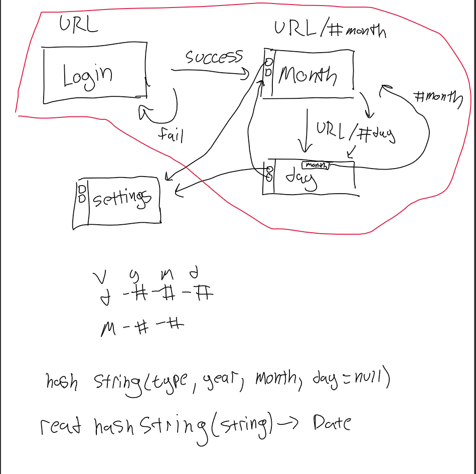

# Overall Architecture decisions
Status: Accepted

Deciders: Alan, Daisuke, Edmund, Edward, Elisa, Etienne, Evan, Kenny

Date: 5/24-5/25/2021

## Decisions
### MVP: Month + Day view (with integration) ONLY
#### Month view
- Calendar month view
- Change month/year
- Shows only 5 top bullets for each day from that month 
- Users can click on each day to go to the day view for that day 
#### Day view 
- Schedule for the day that holds bullets for each time (broken up by hour) (Events + tasks with due dates in that day) 
- CRUD functions on schedule for this day only
- Notes area page
#### Sidebar web component (goes on each page)
- Has links to::
- Month (calendar)
- Day view 
- Weekly view (later) 
- Settings (#settings later)
- Logout 

### Navigation diagram for MVP:

Successful login -> month view 
Clicking on a date on the month view will add date as url hash, move to day page for that date 

### Url hash format: 
day: v-y-m-d
Month: v-y-m
**v** - view type (d - daily, m - monthly, w - weekly, allows for scanning for rest of url)
**y** - year number
**m** - month number
**d** - day number 

### Backend: 
- Will have login and authentication
- Use nodejs as our basic framework
  - Using libraries - express, path, body-parser, mongoose
  - app.js  - top most file for our database 
- APIs are mostly completed
- How to reference bullets when user logs in - user id? 
  - Once login is successful, we will tell CRUD runtime the user’s id
  - Crud runtime will use this to query bullets
  - Page then works with what we get  
  - This way API functions won’t change 

### Bullet class (default)
Attributes: 
- ID
- Name/Title
- Date  = Date object (start date)
- Type = {event, task, note}
- Tag = {} (default tags: daily, monthly, undated - undeletable) 
- description(content)
- Event (type = event):
- Due Date = Date object 
- Task (type = task):
- Due Date = Date object
- Status
Store as object with unused fields set to null 

### General roadmap:
1. Get 3 MVP pages done by Wednesday 
If we finish this  and have time:
2. Settings page	
3. Remove account
4. Download, upload
5. Weekly view 
		CRUD on bullets for day also
6. Minicalendar
7. Dashboard
8. Colors/themes 