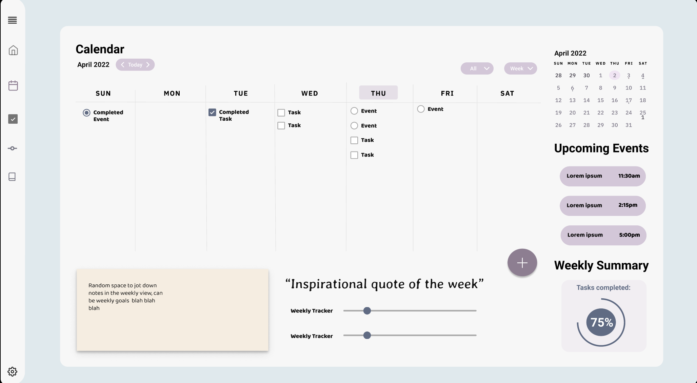
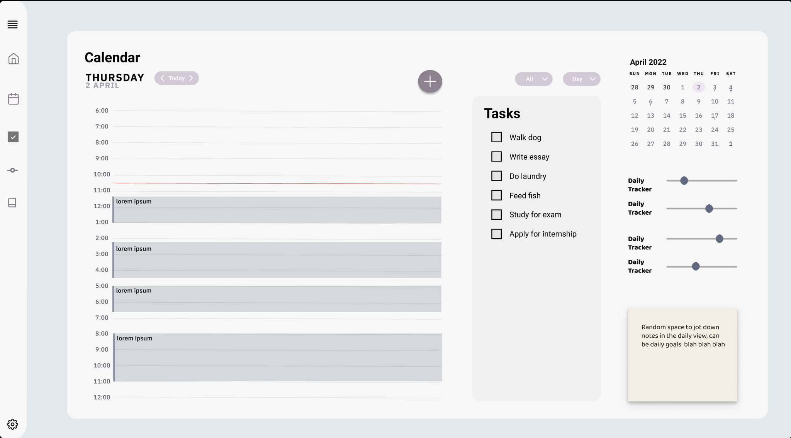
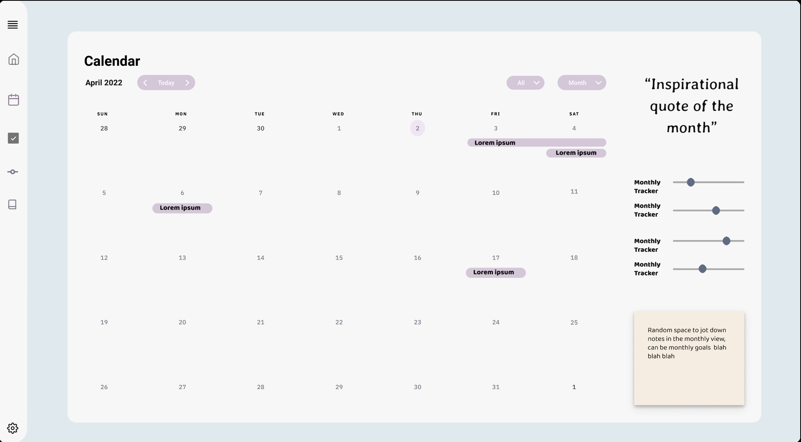
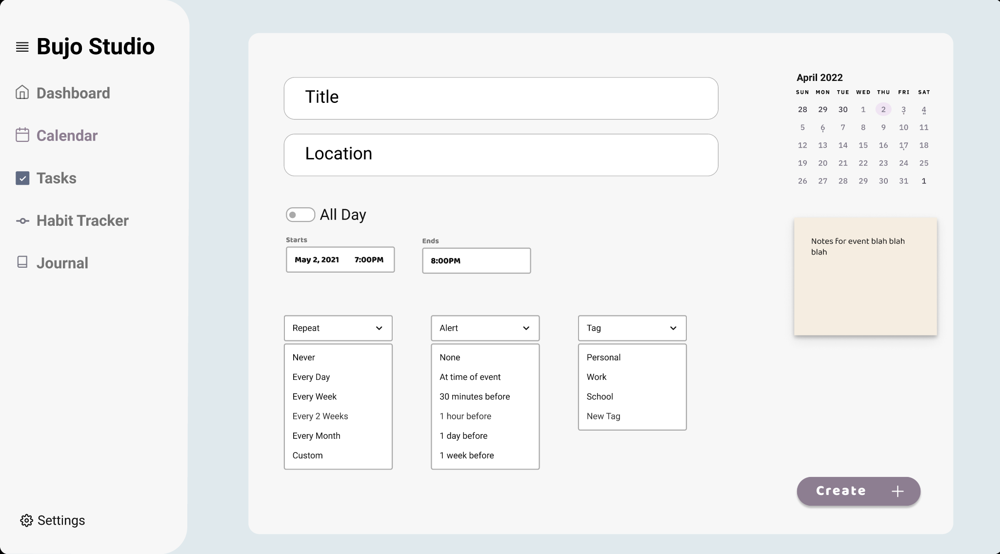

# General Layout of Bullet Journal Website #
### Click [here](https://www.figma.com/proto/2GMo57NxhS1fh2Hcw6cMCt/Bullet-Journal-Wireframe?node-id=13%3A5234&scaling=scale-down&page-id=1%3A5647) to view on Figma ###
## Homepage ##

## Register/Login ##

## Dashboard ##
Clicking on the calendar, tracker, or notes widgets will redirect the user to the corresponding full page views

## Calendar Weekly View ##

## Calendar Daily View ##

## Calendar Monthly View ##

## Add Event Form ##

## Journal ##

