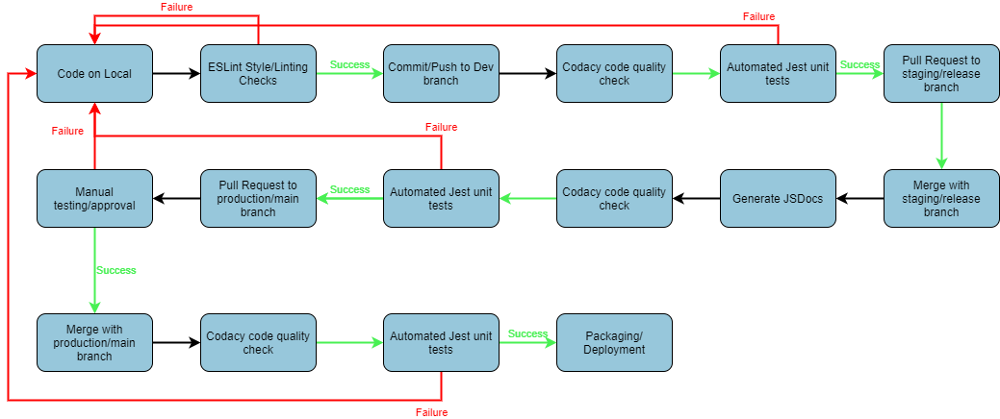

# Powellmon CI/CD Pipeline Phase 1 Status 
## Pipeline diagram

## Steps 
### ESLint Style/Linting checks 
The first step in our pipeline is to run the ESLint tool for linting and code style enforcement. This occurs when any code in the `source` folder is about to be committed to the repo. 

This step is implemented with a pre-commit hook in the file `git-hooks/precommit` that runs ESLint on any staged files. This step in our pipeline is currently functional, but only contains some basic linting rules. We plan to update our linting rules when we decide on a style guide. 

### Codacy code quality check 
After the code passes the ESLint style/Linting checks, it is then committed/pushed to a dev branch on the repo. Once the code is pushed, the next step in our pipeline is to run a Codacy code quality check on the pushed code. 

This step is implemented using Github Actions and is the first job defined in the workflow at `.github/workflows/test-workflow.yml`. The workflow is triggered when anything new is pushed to the `source` folder, and the first job checks out a copy of the code and uses [this Github action](https://github.com/marketplace/actions/codacy-analysis-cli#analysis-with-default-settings) to run Codacy's static analysis tools on the code. This step in our pipeline is currently functional. 

### Automated Jest unit tests
After the code passes the Codacy code quality check, we then run our automated unit tests on the code using Jest. 

This step is implemented using Github Actions and is the second job defined in the workflow at `.github/workflows/test-workflow.yml`. This job checks out a copy of the code and runs the command `npm run test` to run our Jest tests (located in `test/` folder) on the source code. This step in our pipeline is currently functional and will continue to work as we add new source code and tests. 

### Generate JSDocs 
After the code passes both the Codacy code quality check and unit tests, we then open a pull request and merge our code to the staging/release branch. Once the code is pushed to the release branch, in addition to running the code quality check and unit tests once more, the next step in our pipeline involves automatically generate documentation from the code. 

This step is implemented using Github Actions and is defined in the workflow at `.github/workflows/JSDoc-workflow.yml`. The workflow is triggered when anything new is pushed/merged with any release branch. After checking out a copy of the code, this workflow runs this [action](https://github.com/marketplace/actions/jsdoc-action), which uses JSDoc to generate Javscript documenation. The workflow then pushes this documentation to the `docs/` folder in our repo. This step in our pipeline is currently functional and will continue to work as we add new source code. 

### Manual testing/approval
After the code goes through the release branch, we then open a pull request to merge the code to our production/main branch. In our approval process for this pull request, we plan to also include some manual integration- or system-level testing. 

This step is not currently implemented yet. We plan to implement this step in phase 2. 

### Packaging/deployment
The final step in our pipeline is packaging and deployment, which occurs after the code has arrived at the production/main branch and passed all tests. This step is not currently implemented yet. We plan to implement this step in phase 2. 